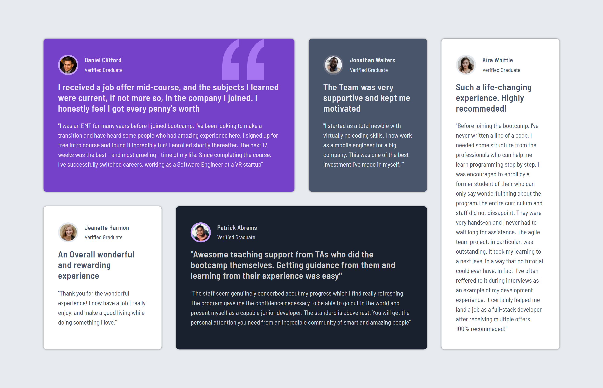
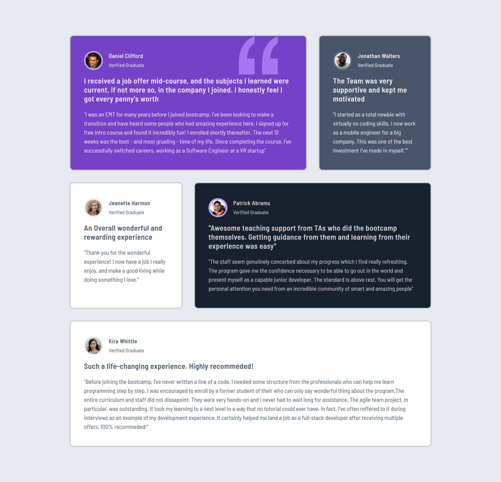
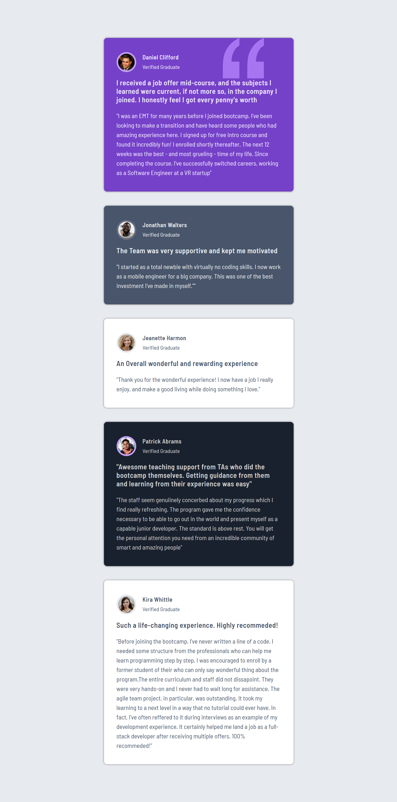
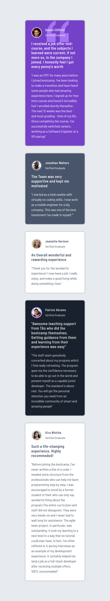

# Testimonials Grid Section

A responsive testimonials grid component built with HTML and CSS Grid. This project features a modern, card-based layout showcasing student testimonials with a sophisticated grid system that adapts seamlessly across all devices.

## Preview

The component displays a dynamic grid of testimonial cards featuring:

- Five unique testimonial cards with varied layouts
- Profile images with custom colored borders
- Verified Graduate badges
- Compelling testimonial titles and detailed feedback
- Decorative quotation background on featured card

### Desktop Preview



### Large Tablet Preview



### Small Tablet Preview



### Mobile Preview



## Features

- 🎨 Modern, professional card-based design
- 📱 Fully responsive across 4 breakpoints (Desktop, Large Tablet, Tablet, Mobile)
- 🎯 CSS Grid layout with complex spanning
- 🔤 Google Fonts integration (Barlow Semi Condensed)
- 💫 Subtle shadow effects for depth
- ♿ Semantic HTML structure with proper article elements
- 🖼️ Decorative SVG quotation mark on featured card
- 🎨 Unique color schemes for each testimonial card

## Technologies Used

- HTML5
- CSS3 (CSS Grid & Flexbox)
- Google Fonts (Barlow Semi Condensed)
- REM units for scalable typography

## Project Structure

```
project-root/
│
├── index.html          # Main HTML file
├── style.css           # Stylesheet
├── README.md           # Project Documentation
└── Images/
    ├── image-daniel.jpg         # Daniel's profile photo
    ├── image-jonathan.jpg       # Jonathan's profile photo
    ├── image-jeanette.jpg       # Jeanette's profile photo
    ├── image-patrick.jpg        # Patrick's profile photo
    ├── image-kira.jpg           # Kira's profile photo
    ├── bg-pattern-quotation.svg # Decorative quotation SVG
    └── screenshots/
        ├── desktop-preview.png  # Desktop screenshot
        ├── large-tablet-preview.png   # Tablet screenshot
        ├── small-tablet-preview.png   # Tablet screenshot
        └── mobile-preview.png   # Mobile screenshot
```

## Installation

1. Clone or download this repository
2. Ensure all profile images are placed in the `Images` folder
3. Open `index.html` in your web browser

## Design Specifications

### Colors

#### Card Backgrounds

- **Daniel (Purple)**: `hsl(263, 55%, 52%)` - Moderate violet
- **Jonathan (Gray-Blue)**: `hsl(217, 19%, 35%)` - Dark grayish blue
- **Jeanette (White)**: `hsl(0, 0%, 100%)` - White
- **Patrick (Dark Navy)**: `hsl(219, 29%, 14%)` - Very dark grayish blue
- **Kira (White)**: `hsl(0, 0%, 100%)` - White

#### Text Colors

- **Light Text**: `hsl(260, 100%, 95%)` - Very light violet
- **Light Gray**: `hsl(214, 17%, 92%)` - Light grayish blue
- **Dark Text**: `hsl(217, 19%, 35%)` - Dark grayish blue
- **Body Gray**: `hsla(0, 0%, 81%, 1)` - Light gray

#### Border Colors

- **Daniel's Border**: `hsl(264, 82%, 80%)` - Light violet
- **Jonathan's Border**: `hsl(224, 10%, 45%)` - Grayish blue
- **Jeanette's Border**: `hsl(214, 17%, 92%)` - Light grayish blue
- **Patrick's Border**: `hsl(264, 82%, 80%)` - Light violet
- **Kira's Border**: `hsl(214, 17%, 92%)` - Light grayish blue

#### Background

- **Page Background**: `hsl(214, 17%, 92%)` - Light grayish blue

### Typography

- **Font Family**: Barlow Semi Condensed (Google Fonts)
- **Base Font Size**: 10px (62.5% of browser default)
- **Profile Name**: 1.5rem (15px), weight: 600
- **Profile Status**: 1.4rem (14px)
- **Testimonial Title**: 2.2rem (22px), weight: 600
- **Testimonial Text**: 1.6rem (16px), line-height: 1.5

### Layout

#### Desktop (>1340px)

- **Grid Columns**: 4 equal columns
- **Max Width**: 1280px
- **Gap**: 3.6rem (36px)
- **Card Padding**: 4rem 3.6rem (40px 36px)

#### Large Tablet (≤1340px)

- **Grid Columns**: 3 equal columns
- **Max Width**: 960px
- **Kira's card**: Spans full width at bottom

#### Tablet (≤1030px)

- **Grid Columns**: 1 column (stacked)
- **Max Width**: 480px
- **Card Padding**: 3.6rem 3.2rem (36px 32px)

#### Mobile (≤520px)

- **Grid Columns**: 1 column
- **Max Width**: 280px
- **Card Padding**: 3.2rem 2.8rem (32px 28px)

### Grid Spanning Logic

**Desktop Layout:**

- Daniel's card: Spans 2 columns (col 1-2)
- Jonathan's card: Single column (col 3)
- Kira's card: Single column, 2 rows (col 4, row 1-2)
- Jeanette's card: Single column (col 1, row 2)
- Patrick's card: Spans 2 columns (col 2-3, row 2)

## Responsive Breakpoints

The component uses four carefully planned breakpoints:

1. **Desktop**: Above 1340px - Full 4-column grid
2. **Large Tablet**: 1030px - 1340px - 3-column grid
3. **Tablet**: 520px - 1030px - Single column stack
4. **Mobile**: Below 520px - Compact single column

## Customization

You can easily customize the component by modifying values in `style.css`:

- Change card colors by updating HSL values in testimonial classes
- Adjust grid layout by modifying `grid-template-columns`
- Update breakpoints in media queries for different responsive behavior
- Modify typography by changing font sizes and weights
- Adjust spacing with padding and gap properties
- Change border colors on profile images

## Browser Support

This component works on all modern browsers:

- Chrome
- Firefox
- Safari
- Edge
- Opera

## Accessibility Features

- Semantic HTML with `<article>` and `<section>` elements
- Proper heading hierarchy (implied through styling)
- Alt text for all profile images
- Descriptive class names for screen readers
- High contrast text for readability

## Key CSS Techniques Used

- **CSS Grid**: Complex multi-column layout with spanning
- **Flexbox**: Profile wrapper alignment
- **REM Units**: Scalable, accessible typography
- **Media Queries**: Multiple breakpoints for responsive design
- **Background Images**: Decorative SVG pattern positioning
- **Box Shadow**: Depth and elevation effects
- **Border Radius**: Circular profile images and rounded cards

## Credits

This project is a solution for a Frontend Mentor challenge, designed to help improve front-end coding skills through practical grid layout implementation and responsive design techniques.

## Future Enhancements

- [ ] Add CSS variables for easier theming
- [ ] Implement dark mode toggle
- [ ] Add hover animations on cards
- [ ] Include transition effects
- [ ] Add loading skeleton states
- [ ] Implement accessibility improvements (ARIA labels)

## License

This project is open source and available for personal and educational use.

---
